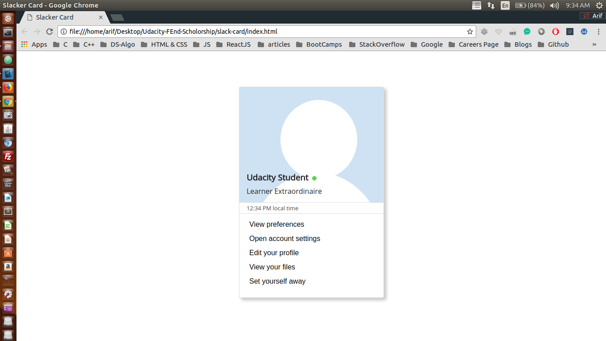

## Project: Creating a Slack card. Slack Card given information about a user

This simple project is a part of Udacity's Front End Scholorship challenge <br />

## Concepts Learnt:

```css

    * {
        box-sizing: border-box;
    }

    body {
        font-family: 'Open Sans', sans-serif;
        color: #222;
    }

    .card {
        height: 475px;
        width: 325px;
        box-shadow: 5px 5px 10px 1px rgba(153, 153, 153, 0.5);
        border-radius: 5px;
        margin: 80px auto;
    }

    .top {
        height: 55%;
        border-radius: 4px 4px 0px 0px;
        border: 1px solid #ddd;
        padding: 0px 16px;
        background-image: url( ../img/profile-placeholder.svg );
    }

    .name {
        padding-top: calc(475px * 0.40);
        margin: 0px;
    }

    .status {
        display: inline-block;
        width: 10px;
        height: 10px;
        margin-left: 4px;
        border-radius: 5px;
        background-color: #60D156;
    }

    .title {
        margin-top: 8px;
    }

    .middle {
        height: 5%;
        border-left: 1px solid #ddd;
        border-right: 1px solid #ddd;
        padding: 0px 16px;
    }

    .time {
        color: #444;
        font-size: 0.8em;
        padding-top: 0.2em;
    }

    .bottom {
        height: 40%;
        border-radius: 0px 0px 4px 4px;
        border: 1px solid #ddd;
        padding: 8px 16px;
    }

    .profile-action {
        display: block;
        width: 100%;
        height: 32px;
        font-size: 1em;
        text-align: left;
        border: 0px;
        background-color: white;
        border-radius: 4px;
    }

    .profile-action:hover {
        background-color: #00A5D2;
        color: white;
    }
```

### Here is the screen shot of the project

<p align="center">
  
</p>