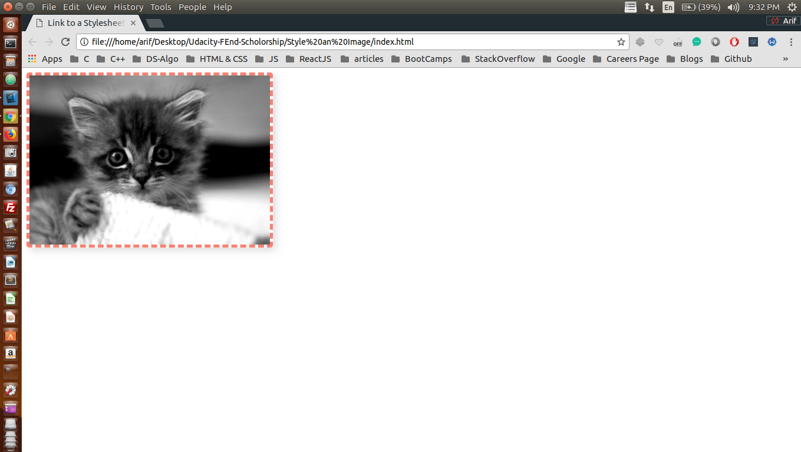

## Project: styling a given image using CSS

This simple project is a part of Udacity's Front End Scholorship challenge <br />

## Concepts Learnt:

### Following CSS concepts were cleared in this project
* border property
  * border: [border-width] [border-style] [color-of-border];
  ```css

  #example{
      border: 5px dashed salmon;
  }
  ```
* border-radius : We can give any HTML element rounder corners with the help of border-radius property 

  ```css
  #example-one{
      border-radius: 10px;
      background: #BADA55;
  }

  #example-two{
      border-radius: 10px;
      border: 3px solid #BADA55;
  }
  ```

* box-shadow: We can add a shadow to any HTML element using box-shadow HTML element
  ```css
  #example-one{
      box-shadow: 5px 5px 5px 0px cyan;
  }
  ```
  * syntax: 
    * box-shadow: [horizontal offset] [vertical offset] [blur radius] [optional spread radius]  [color];


### Before Adding JS

<p align="center">
  
</p>