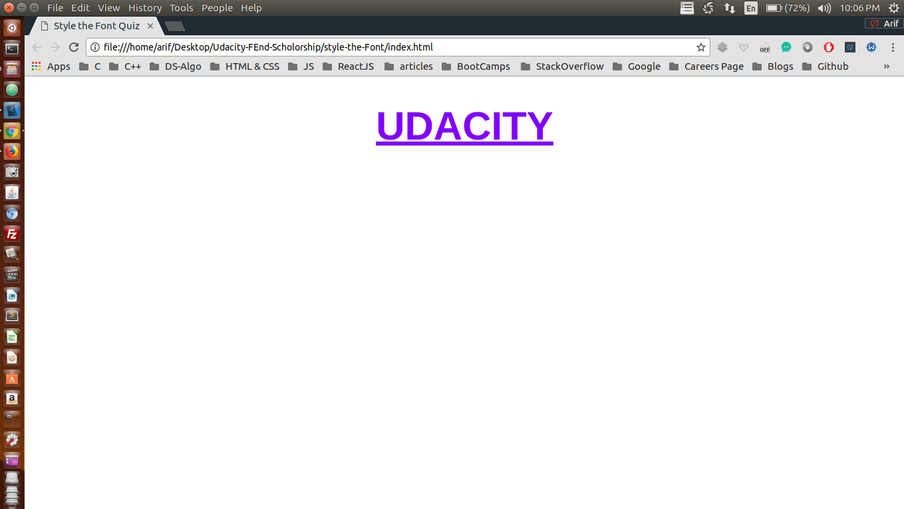

# Project: This small project is names as writing-selectors 

This simple project is a part of Udacity's Front End Scholorship challenge <br />

## Concepts Learnt:

### Styling or decorating a given piece of text
    
```css
    #menu {
        text-align: center;
    }

    .item {
        color: red;
    }

    .picture {
        border-radius: 5px;
    }

    .description {
        font-style: italic;
    }
```

### Screenshot of the project

<p align="center">
  
</p>