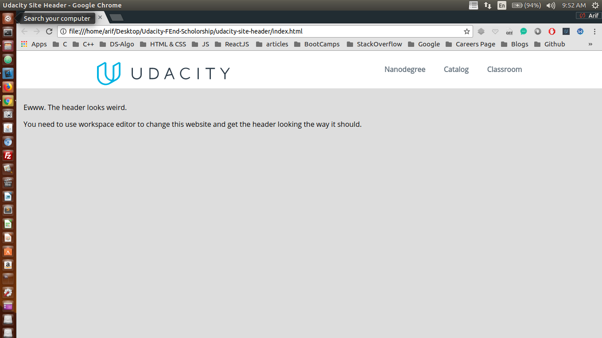

## Project: styling a given webpage i.e a udacity websites header

This simple project is a part of Udacity's Front End Scholorship challenge <br />

## Concepts Learnt:

```css

    * {
        box-sizing: border-box;
    }

    body {
        font-family: 'Open Sans', sans-serif;
        background-color: #ddd;
        margin: 0;
        padding: 0;
    }

    header {
        font-weight: 800;
        -webkit-font-smoothing: antialiased;
        color: #697681;
        font-weight: 400px;
        background: white;
        height: 85px;
        padding: 15px;
    }

    section {
        padding: 16px;
    }

    .flex-container {
        display: flex;
    }

    .space-between {
        justify-content: space-between;
    }

    .vertical-centerer {
        height: 100%;
        flex-direction: column;
        justify-content: center;
    }

    .header-content {
        width: 960px;
        margin-left: auto;
        margin-right: auto;
    }

    .logo {
        width: 300px;
        display: inline-block;
        margin: 10px 0px;
    }

    .menu {
        list-style: none;
        list-style-type: none;
    }

    .menu > li {
        display: inline;
        margin-left: 37.5px;
    }

```

### Here is the screen shot of the project

<p align="center">
  
</p>