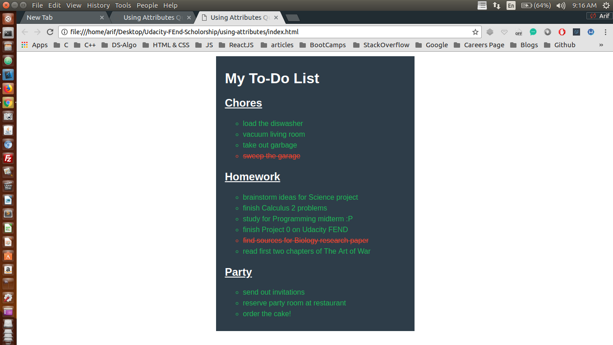

## Project: Styling a given webpage. The imporatace of using attributes in CSS

This simple project is a part of Udacity's Front End Scholorship challenge <br />

## Concepts Learnt:

```css

    body {
        font-family: Arial;
    }

    #to-do-list {
        width: 400px;
        background: #2e3d49;
        padding: 10px 20px;
        margin: 10px auto;
    }

    .title {
        color: #fff;
    }

    .underline {
        text-decoration: underline;
    }

    .list {
        list-style-type: circle;
        text-align: left;
        font-size: 16px;
        color: #1fba58;
        line-height: 24px;
    }

    .finished {
        color: #f4442f;
        text-decoration: line-through;
    }
```

### Here is the screen shot of the project

<p align="center">
  
</p>